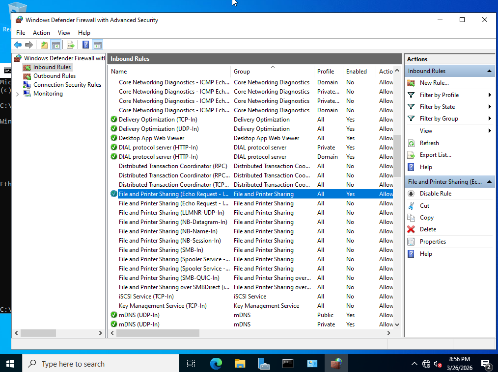
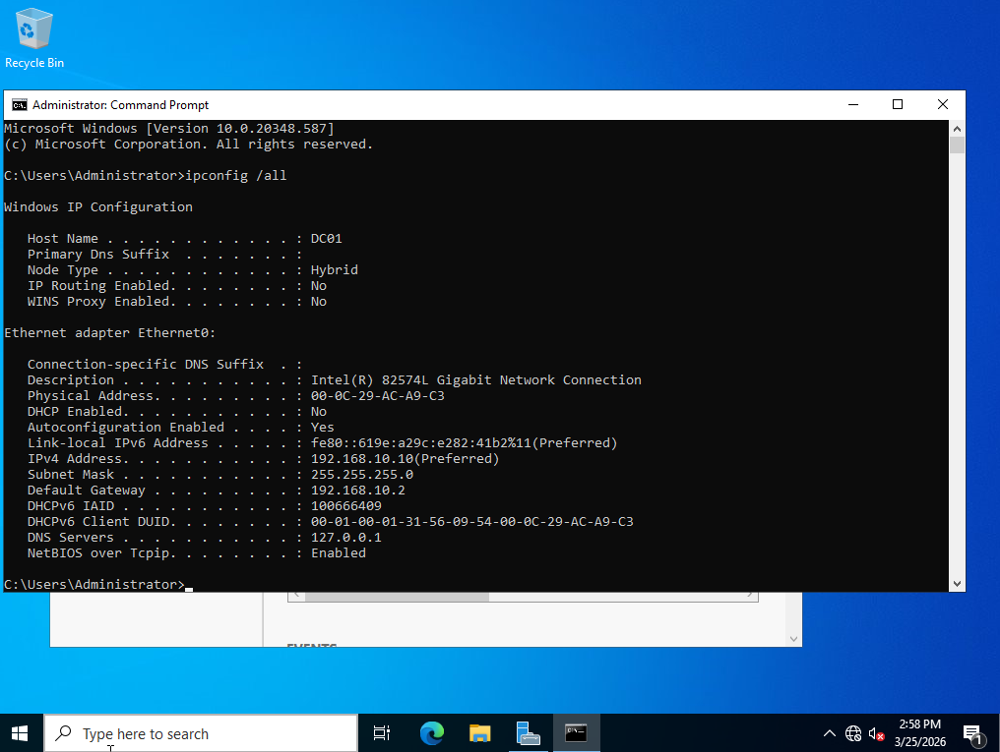
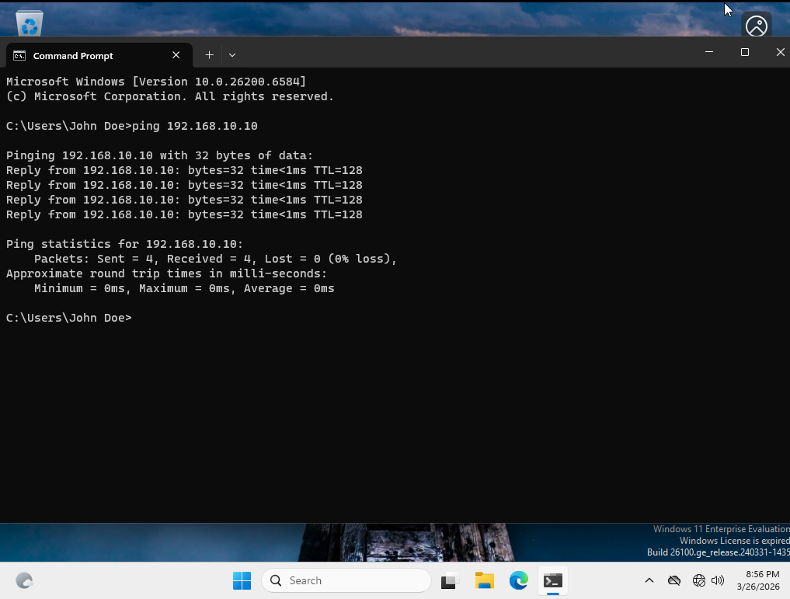

# Phase 1.0: Environment Setup
## 1.1: Hardware / Software Utilization
This section discusses how my VM's will be setup on my personal host, along with the resources allocated to each Virtual Machine

*   **Host Machine:** Windows PC (16GB RAM / NVME SSD)
*   **Documentation Station:** Laptop
*   **Hypervisor:** VMware Workstation

**VM Resource Allocation**
| VM Name | Operating System | Role | RAM | SSD Space | Processors |
| :--- | :--- | :--- | :--- | :--- | :--- |
| **DC01** | Win Server 2022 (Desktop Experience) | Domain Controller | 4 GB | 20 GB | 2 |
| **CLIENT01** | Windows 11 Enterprise | Workstation | 4 GB | 64 GB | 2 |

## 1.2: Virtual Network Configurations
These are the setting for the VMware network editor that mimic a switch connecting the devices, like that in a real-world environment. The network type was set to NAT, in order to allow for internet access while still keeping the network isolated

*   **Network Type:** NAT (VMnet8)
*   **Subnet IP:** 192.168.10.0
*   **Subnet Mask:** 255.255.255.0
*   **Gateway:** 192.168.10.2 (VMware Default)
*   **DHCP Status:** Disabled in VMware (To be managed by Windows Server DC01)

## 1.3 Build Steps
* **Configure VMware Virtual Network**
    * Verified that DHCP is disabled on VMnet8 (DC01 will handle DHCP later)
    * Assigned the virtual machines to VMnet8
* **Windows Server 2022 Installation**
    * Standard "Desktop Experience" installation.
    * Set static IP `192.168.10.10` to ensure DNS reliability
    * Set preferred DNS server to `127.0.0.1` (Loopback Address)
    * Renamed computer to `DC01`
* **Windows 11 Client Installation**
    * Performed clean install of Windows 11 Enterprise
    * Set "temp" static IP `192.168.10.20` to allow communication
    * Verified network connectivity to `DC01` via ICMP (ping)

## 1.4 Troubleshooting 
This section goes over some troubles I ran into while attempting to get through phase 1, along with the solution to solve it.

   <b>Error 1: While attempting to ping DC01 from CLIENT01 the requests were timed out</b>
    
   
    
   <i>Fix: Went into Windows Defender Firewall w/ Advanced Security on both machines to allow inbound rule for ICMPv4</i>

## 1.5 Verification Screenshots
The section houses some screenshots showcasing that all my steps were a complete success

   <b>DC01 Network Configuration</b>
    
   
    
   <i>Figure 1: Confirmed Static IP and DNS settings on DC01.</i>

   <b>Client Connectivity Test</b>
    
   
    
   <i>Figure 2: Successful ICMP ping from Windows 11 Client to DC01.</i>

