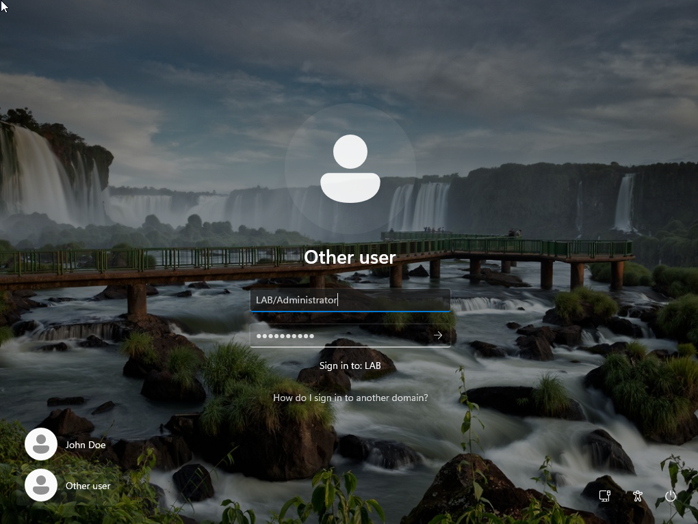
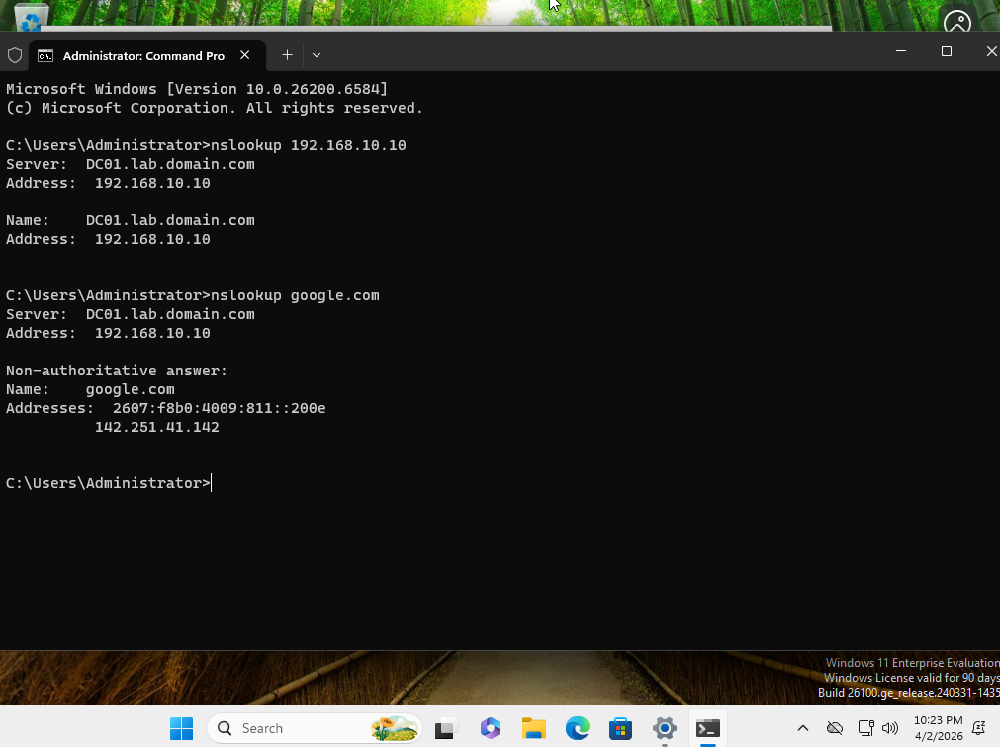
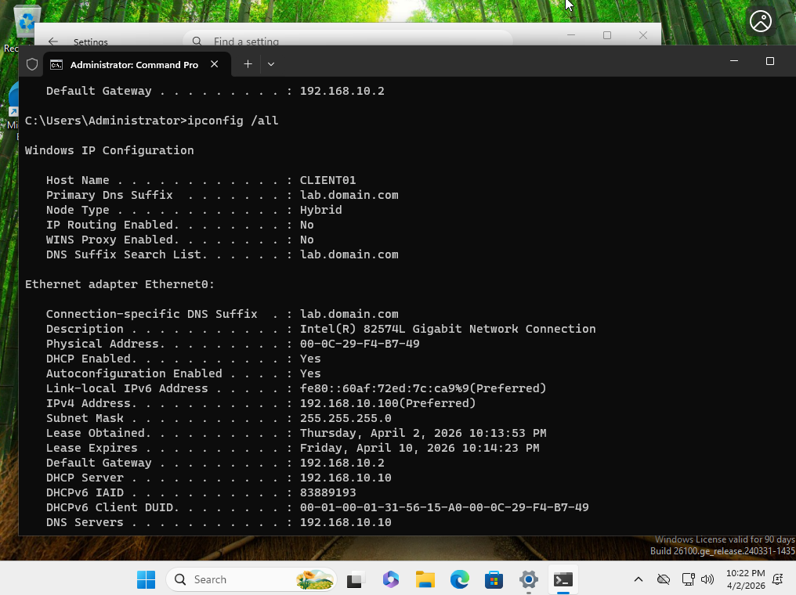

# Phase 2.0: Active Directory Setup
This phase focuses on deploying Active Directory Domain Services (AD DS) on DC01, along with configuring DNS and DHCP services to support domain functionality within the lab environment.
## 2.1: Domain Controller & Adding CLIENT01 to Domain
This section documents the process of promoting DC01 to a domain controller and joining CLIENT01 to the newly created domain.
* **Installing Active Directory Domain Services**
    * On DC01, go to Server Manager > Manage > Add Roles & Features > Active Directory Domain Services
    * After installation click option for "Promote this server to a domain controller"
    * Added a new forest with the domain name lab.domain.com, in order to follow sub domain naming practices
* **Configuring setting on CLIENT01**
   * Set prefered DNS to 192.168.10.10 (DC01)
   * Use "nslookup lab.domain.com" to verify
   * Navigate to Settings > System > About > "Domain or workgroup"
   * Set Domain to "LAB.DOMAIN.COM", Then use administrator login credentials

## 2.2: DNS Server
This section demonstrates DNS configuration concepts including reverse lookup zones and DNS forwarding.
* **Reverse Lookup Zone**
   * In DNS Manager, Reverse Lookup Zones > New Zone > Primary Zone > IPV4
   * Set Network ID: 192.168.10
   * Create PTR record for 192.168.10.10 w/ hostname dc01.lab.domain.com
   * Use "nslookup 192.168.10.10" to verify
* **DNS Forwarders**
   * In DNS manager, go to dc01.lab.domain.com > properties > forwarders
   * Add: 8.8.8.8 (google)
   * Add: 1.1.1.1 (cloudflare)
  
## 2.3: DHCP Server
This is where I then use the DHCP setting to create a IP scope for the domain so I can dynamically assign an IP address to CLIENT01
* **Installing DHCP**
    * On DC01, go to Server Manager > Manage > Add Roles & Features > DHCP Server
    * Once installed then make sure to complete DHCP configuration & authroize for AD
* **Setting IP Scopes**
   * In DHCP, IPV4 > New Scope
   * Start IP Address: 192.168.10.100
   * End IP Address: 192.168.10.200
   * Default Gateway: 192.168.10.2
   * DNS: 192.168.10.10
* **Setting Dynamic IP on CLIENT01**
   * On CLIENT01, change Manual to Dynamic (DHCP)
   * Verify with *"ipconfig /renew"*

## 2.5: Verification Screenshots
The section houses some screenshots showcasing that my domain, DNS, & DHCP setups were a success

   <b>CLIENT01 Joins Domain</b>
    
   
    
   <i>Figure 1: Confirmed CLIENT01 is joined into domain.</i>

   <b>DNS Reverse Lookup / Forwarding </b>
    
   
    
   <i>Figure 2: Shows a sucessful reverse lookup of 192.168.10.10 & forwarded dns resolution for google.com </i>

   <b>DHCP Enabled on CLIENT01 </b>
    
   
    
   <i>Figure 3: Shows that CLIENT01 has successfully received a dynamic IP address from the domain DHCP server </i>

